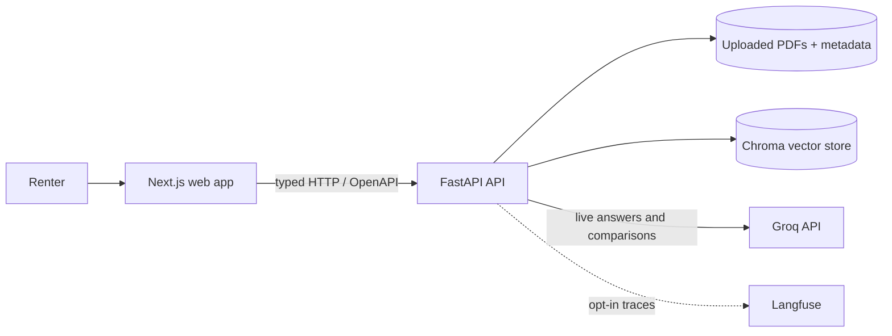
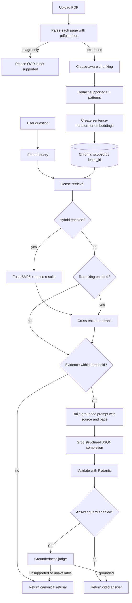

# Architecture

This document is the system-level architecture entry point. See
[Backend Layered Architecture](architecture/layers.md) for Python import rules
and [Architecture Decision Records](adr/) for design rationale.

## System context

Leasora is a local-first, single-tenant web application. The Next.js client
calls a FastAPI API; the API persists uploaded files and retrieval data locally
and calls Groq only for operations that require generated text. Langfuse trace
export is optional.



> Arrows represent runtime data flow. Groq and hosted observability are
> external data boundaries; review the [privacy model](../README.md#privacy-and-security)
> before enabling them.

## Ingestion and question-answering flow



Hybrid retrieval is valid only with reranking in current settings because the
evaluation found that hybrid retrieval alone reduced refusal accuracy.

## Backend boundaries

```text
http/routes/  ->  services/  ->  core/
```

Grimp checks this dependency direction in CI. Schemas and utilities are leaf
modules; `core.security` is a documented service-layer carve-out. See [the
layer contract](architecture/layers.md).

## Key backend modules

| Area | Responsibility |
|---|---|
| `http/routes/` | Health, upload, ask, leases, compare, and eval endpoints |
| `services/ingest/` | PDF parsing, chunking, metadata, retention, and persistence |
| `services/retrieval/` | Embeddings, Chroma, BM25, reranking, and caches |
| `services/rag/` | Retrieval orchestration, refusal, prompts, and answer guards |
| `services/llm/` | Groq client and versioned prompt registry |
| `services/eval/` | Golden datasets, metrics, and LLM judges |
| `core/` | Settings, errors, logging, security, metrics, and Langfuse wrapper |
| `schemas/` | API request and response models |

## Frontend boundaries

The Next.js app uses route groups for marketing and application pages. Shared
UI lives under `components/`, reusable API hooks under `hooks/`, and the typed
`openapi-fetch` client under `lib/`. See the [frontend README](../apps/web/README.md).
## Persistence and lifecycle

| Artifact | Default location or owner | Lifecycle |
|---|---|---|
| Uploaded PDF | `data/uploads/` | Cascade-deleted after 30 days by the startup/daily retention sweep, or manually |
| Lease metadata | JSON-backed lease store | Updated on ingest/refresh; deleted with lease |
| Embeddings and chunks | Chroma | Scoped by `lease_id`; replaced on re-ingest |
| BM25 index | Process-local retrieval service | Rebuilt/removed with lease data |
| Answer caches | Process memory | Lease-scoped; invalidated on re-ingest/delete |
| Comparison history | JSON-backed comparison store | Bounded by configured maximum records |

## Repository map

```text
leasora/
├── apps/
│   ├── api/                 # FastAPI package, tests, and CLI
│   └── web/                 # Next.js application
├── packages/
│   ├── shared-schemas/      # Reserved Python-only cross-package models
│   ├── shared-types/        # Generated OpenAPI TypeScript definitions
│   └── ts-config/           # Shared TypeScript compiler settings
├── services/compose/        # Default app stack + optional observability
├── scripts/                 # CI, import-contract, typegen, and PII checks
├── data/                    # Local runtime artifacts (mostly ignored)
└── docs/                    # Guides, reports, diagrams, and ADRs
```

## Operational boundaries

This version is designed for local, single-tenant use. It has no user
authentication, tenant isolation, distributed cache, or distributed rate
limiter. The in-memory limiter reduces accidental LLM spend; it is not an abuse
protection system. Do not place the API directly on the public internet.

## Related documentation

- [Local setup](setup.md)
- [Backend layer contract](architecture/layers.md)
- [Evaluation report](EVALUATION_REPORT.md)
- [Architecture decisions](adr/)
