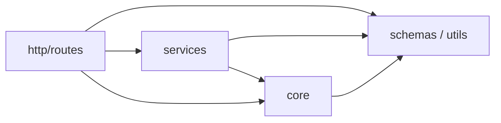

# ADR 002: Python Layered Architecture

**Date:** 2026-07-05
**Status:** In force (verified 2026-07-13)
**Deciders:** Development Team

## Context

The FastAPI backend combines HTTP handling, lease workflows, retrieval and LLM
integrations, and cross-cutting infrastructure. Without explicit boundaries,
those concerns can create circular imports, framework-coupled services, and
inconsistent security or configuration access.

## Decision

Use a three-layer backend with dependencies pointing inward:



Arrows mean “may import.” Runtime call direction may differ.

### Rules

1. `http/routes/` may import services, core infrastructure, schemas, and utils.
2. `services/` must not import `http/`.
3. `core/` must not import `http/` or `services/`.
4. `schemas/` and `utils/` are leaves and must not import higher layers.
5. Environment access is centralized in `core/config.py`.
6. Services may read the cached settings singleton for module-level service
   construction.
7. `core.security` is an explicit service-layer carve-out because PII redaction
   is required at both service and HTTP boundaries.

The complete allowed-import matrix is maintained in
[`docs/architecture/layers.md`](../architecture/layers.md). `grimp.yml` and
`scripts/check_imports.py` enforce the machine-checkable subset in CI.

## Rationale

The layout keeps FastAPI details at the edge while allowing service workflows
to be tested independently. Explicit carve-outs are preferable to pretending
that cross-cutting security concerns occur at only one boundary.
## Consequences

### Positive

- HTTP and framework concerns stay separate from lease workflows.
- Import cycles and upward dependencies are mechanically detectable.
- Service modules can be tested without constructing FastAPI routes.
- The security exception is visible and reviewable.

### Tradeoffs

- Dependency injection and boundary adapters add some boilerplate.
- Cross-cutting concerns need carefully documented exceptions.
- Contributors must understand that import direction and runtime data flow are
  different concepts.

## Verification

Run the same contract used by CI:

```bash
uv run --with grimp --with pyyaml python scripts/check_imports.py
```

## Superseding this decision

A future simplification may flatten the backend, but it must remove or update
the import contract, this ADR, and the layer guide together. Architectural
changes should not occur through ad hoc exceptions.
