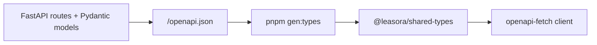

# ADR 004: OpenAPI Code Generation Instead of tRPC

**Date:** 2026-07-05
**Status:** In force (verified 2026-07-13)
**Deciders:** Development Team

## Context

Leasora has a Python FastAPI backend and a TypeScript Next.js frontend. The
HTTP boundary needs one authoritative schema, generated client types, useful
interactive documentation, and a workflow that detects contract drift.

tRPC provides excellent end-to-end typing for TypeScript-only systems, but it
cannot make Python route definitions the source of truth without an additional
schema bridge.

## Decision

Use FastAPI's OpenAPI document at `/openapi.json` as the HTTP contract.
Generate `packages/shared-types/src/api.ts` with `openapi-typescript`, and use
`openapi-fetch` in `apps/web/src/lib/api.ts`.



The CI `gen-types` job regenerates the file and fails when committed output has
drifted. Type generation is intentionally not a pre-commit hook; developers
run it explicitly after API contract changes.

## Consequences

### Positive

- Python route and Pydantic definitions remain the single source of truth.
- Swagger UI at `/docs` and ReDoc at `/redoc` are generated automatically.
- The contract is language-neutral and supported by a broad tool ecosystem.
- Frontend request paths, payloads, and responses are statically checked.

### Tradeoffs

- Contract changes require an explicit generation step.
- Generated types provide compile-time safety but do not replace runtime
  validation at the API boundary.
- CI must keep checking the generated file to prevent schema drift.

## Developer workflow

```bash
pnpm gen:types
pnpm type-check
git diff -- packages/shared-types/src/api.ts
```
## Alternatives considered

### tRPC

Rejected because the backend is Python and tRPC would make a TypeScript
implementation the contract authority or require a second schema translation
layer.

### Handwritten TypeScript interfaces

Rejected because they duplicate the Pydantic contract and drift silently.

### A separately authored OpenAPI file

Rejected for now because FastAPI already derives the schema from executable
route and model definitions. A design-first specification could be reconsidered
if external consumers require independent contract governance.
