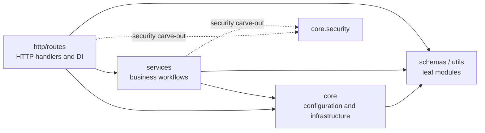

# Backend Layered Architecture

**Status:** Active
**Related:** [ADR 002](../adr/002-python-layered-architecture.md) ·
[`grimp.yml`](../../grimp.yml) ·
[`scripts/check_imports.py`](../../scripts/check_imports.py)

## Dependency direction

Arrows below mean **may import from**; they do not describe runtime calls.



The design keeps framework concerns at the edge and business workflows inward.
`schemas/` and `utils/` are leaves: they must not depend on HTTP or services.

## Allowed imports

| Source | May import internal modules from |
|---|---|
| `http/` | `services/`, `core/`, `schemas/`, `utils/` |
| `services/` | `core/config`, `core/exceptions`, `core/security`, `schemas/`, `utils/` |
| `core/` | sibling `core/` modules, `schemas/`, `utils/` |
| `schemas/` | `utils/` |
| `utils/` | Nothing internal |

`core/security` is a deliberate service-layer carve-out. Redaction is needed at
both the LLM-call and HTTP boundaries; the exception is explicit so that
concern does not force upward imports.

## Enforced forbidden imports

The Grimp configuration rejects:

- `services` importing `http`
- `core` importing `http`
- `core` importing `services`

Run the contract check from the repository root:

```bash
uv run --with grimp --with pyyaml python scripts/check_imports.py
```

## Configuration access

- `http/` and `core/` may call the memoized `get_settings()` function.
- `services/` may call it when constructing module-level service singletons.
- Tests should inject dependencies or clear the settings cache rather than
  reading environment variables directly.
- Direct `os.getenv()` calls outside `core/config.py` are prohibited by
  convention and review.

## Changing the boundaries

Update `grimp.yml`, this document, and
[ADR 002](../adr/002-python-layered-architecture.md) in the same change. If the
layering no longer pays for itself, remove it through an explicit decision
rather than allowing undocumented exceptions to accumulate.
